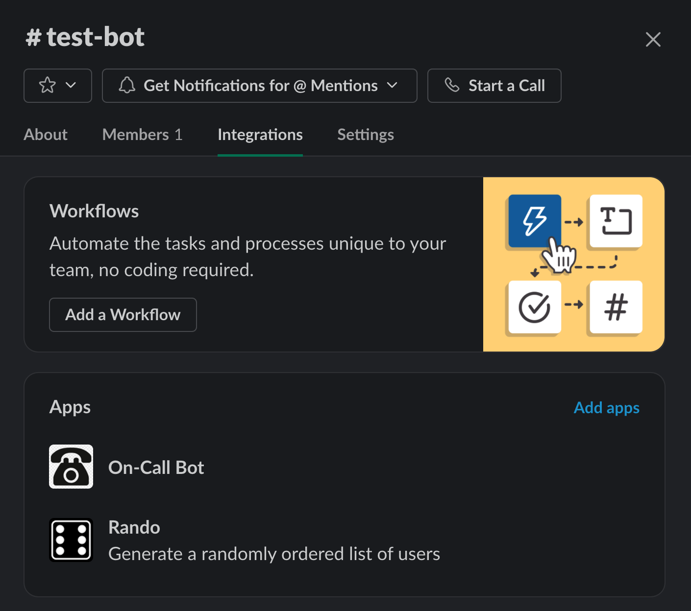
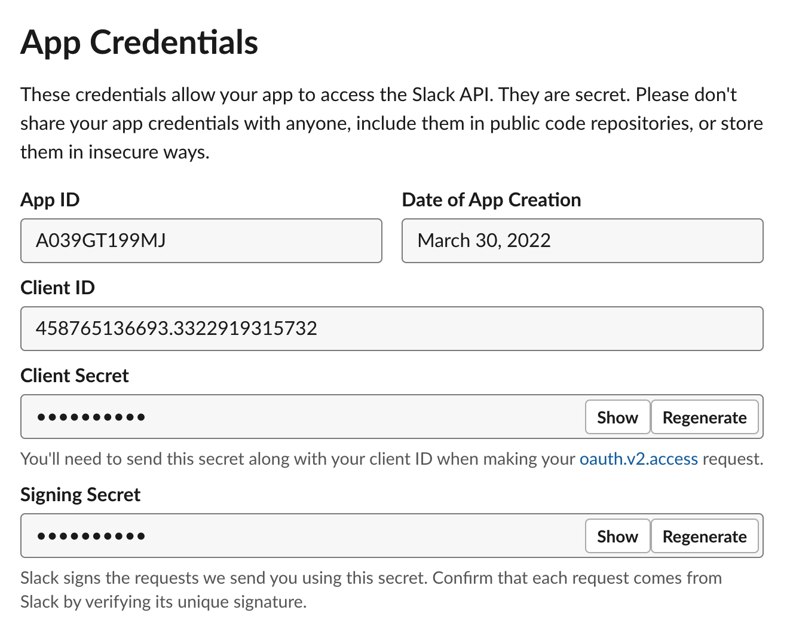
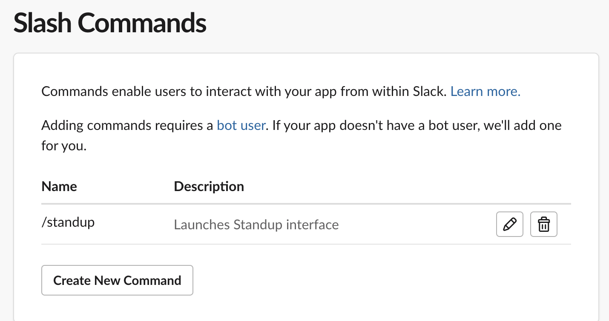
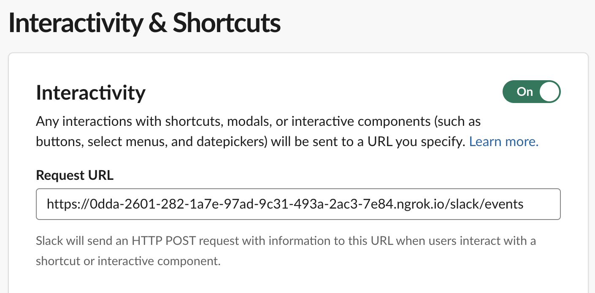
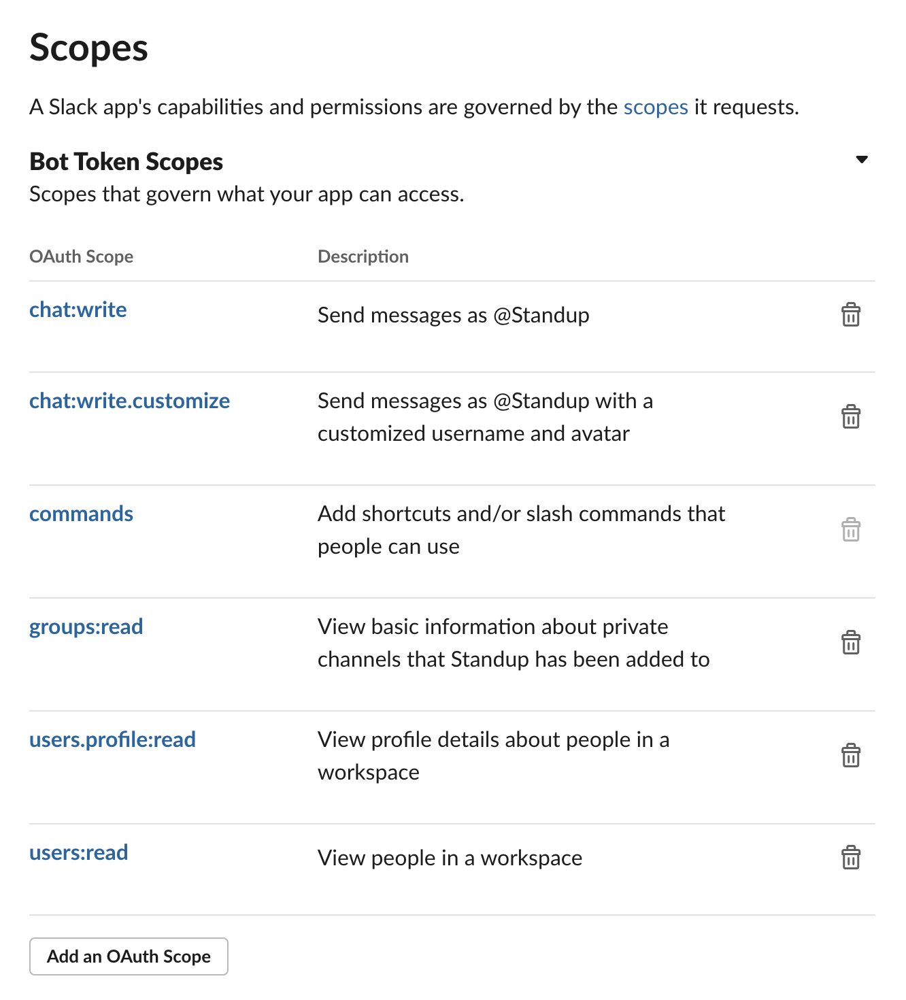

<h1 align="center">Welcome to statndup-bot 👋</h1>
<p>
  
  <a href="#" target="_blank">
    
  </a>
</p>

> A Slack bot to post daily standup status. It launches a modal, prompting users for Yesterday, Today, Parking Lot Items, and Parking Lot Participants

## Install
Add bot to channels where you wish to use it.



## Usage - Slack
```sh
/rando [title]
```

## Deployment
SLS makes it easy to deploy to AWS
```
sls deploy --stage (prod | dev) [--aws-profile profile-name] [--region us-east-2]
```

To inspect the size and content of the deployment without deploying anything to AWS
```
sls package --stage (prod | dev) [--aws-profile profile-name]
```

You can also check configuration substitutions
```
sls print --stage (prod | dev)
```

### Secrets
Create a secret in SecretsManager named `SlackStandup-secret-prod` with the values

* `SLACK_STANDUP_BOT_TOKEN`
* `SLACK_STANDUP_SIGNING_SECRET`

These can be found on the Slack website. Copy-paste the following values.

#### SLACK_STANDUP_BOT_TOKEN
In the app's _OAuth & Permissions_:


#### SLACK_STANDUP_SIGNING_SECRET
In the app's _Basic Settings_ copy the value for _Signing Secret_:



## Local Testing
Testing locally requires Docker, and setting the following environment variables in a `.env` file. These are the same values found in the **Secrets** section of this document.

* `SLACK_STANDUP_TOKEN`
* `SLACK_STANDUP_SIGNING_SECRET`

Deploy to Docker with the following command:
```sh
npm run serverless-localstack
```
This retrieves the local environment variables and creates a secret and DynamoDB table in the Localstack instance.

### Script Permissions
Localstack is loaded with scripts in `src/test/scripts`. These may need updated permissions to execute.

```sh
chmod 755 src/test/scripts/*
```

### Slack -> Locally running Lambda
To connect Slack to this running instance, start `ngrok` with either of these commands. This assumes `ngrok` is installed in the user's home directory.

```sh
npm run ngrok

~/ngrok http 5000
```

This will create a URL to enter into Slack's _Slash Command_ interface for this app.

## Slack Configuration

This bot uses a **Slash Command** and enabled **Interactivity**.



* Slash Commands and Interactivity use the same Request URL, which ends in `/slack/events`
* For local testing, set these to the URL generated by `ngrok`
* When the app is live, set these to the lambda URL

The app needs permissions to interact with the Slack workspace. Enable OAuth scopes in Slack.



* `chat:write`
* `chat:write.customize`
* `commands`
* `users.profile:read`
* `users:read`

## 
## Author

👤 **Steve Thompson**


## Show your support

Give a ⭐️ if this project helped you!

***
_This README was generated with ❤️ by [readme-md-generator](https://github.com/kefranabg/readme-md-generator)_